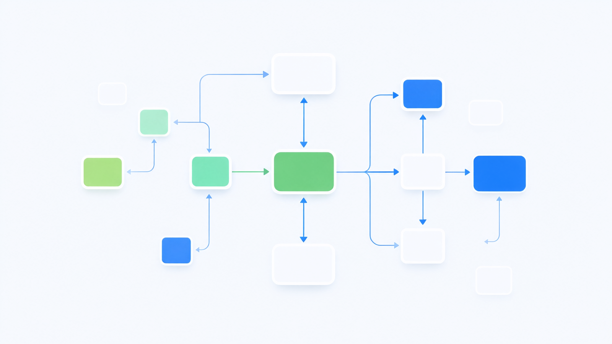
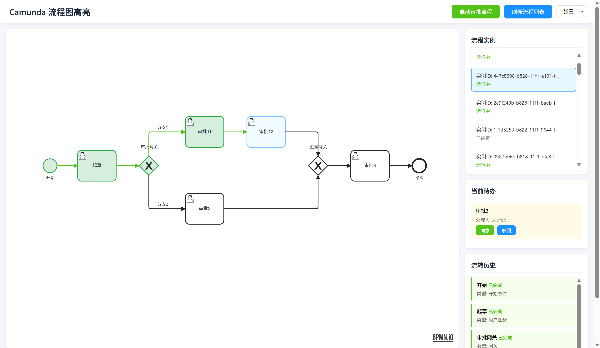
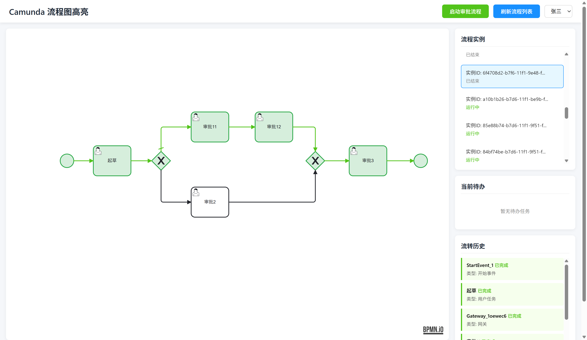

# Camunda 流程图高亮实战：4 种实现路径与 7 个必踩的坑


> 把"流程走到哪了"这件事一次做对：从连线不准、节点不亮，到缓存冲突、字段全为 null。

## 导语

"帮我把流程图做成已办高亮——走过的节点标绿、走过的连线标蓝、当前待办节点呼吸高亮。"

这个需求在任何流程类系统里几乎一定会出现。它听起来像前端刷个颜色的事，实际做起来会连续撞上四类问题：**路径记不准、数据存不进、样式不生效、服务启动就报错**。

下面把整套方案完整复盘一遍：四种实现路径的取舍、最终落地的配置与代码、以及七个真实踩到的坑。文中所有结论都在 **JDK 17 + Spring Boot 3.5.5 + Camunda 7.24.0 + Mybatis 3.5.15 + MySQL 8.0.46 + bpmn-js** 环境里实测过。

---

## 一、先把需求拆成三件事

流程图高亮看着是一个功能，实际要同时回答三个问题，难度依次递增：

**第一，哪些节点已经走完？**
包括开始事件、用户任务、网关、结束事件。这个最容易，历史表里就有。

**第二，流程实际走了哪几条连线？**
这是整个需求里最难、也最容易出错的一环。一个排他网关下面挂两条分支，流程只走了其中一条，但如果你判断逻辑写错，两条线会一起亮起来——用户一看就懵了："我明明选的是同意，为什么驳回那条线也亮了？"

**第三，当前卡在哪个节点？**
即"有开始时间、没有结束时间"的那个活动。

把这三件事想清楚，后面的技术选型就有判断依据了。

---

## 二、四种实现路径，以及各自的代价

### 路径一：BpmnParseListener + ExecutionListener

思路是在流程定义被解析（部署）的阶段，动态给每条连线的 `take` 事件挂一个执行监听器。

```java
@Override
public void parseSequenceFlow(Element sequenceFlowElement,
                              ScopeImpl scopeElement,
                              TransitionImpl transition) {
    transition.addListener(ExecutionListener.EVENTNAME_TAKE, recordExecutionListener);
}
```

**代价**：监听器是在"解析期"注入的，意味着**代码改了必须重新部署流程定义**才生效；已经跑在老版本上的流程定义不会自动获得新逻辑。另外它对元素类型的适配要求很高，漏掉一类元素就会出现"某个节点永远不亮"。

### 路径二：Command 拦截器

思路是绕过 BPMN 解析，直接在引擎的命令责任链上拦截连线流转命令 `TakeTransitionCmd`。

这条路最大的问题是：**`TakeTransitionCmd` 是引擎内部类，不是稳定公开 API**。包路径会随版本变化，经常在编译期就直接报错：

```
java: 找不到符号
  符号:   类 TakeTransitionCmd
```

而且即便编译通过，它属于内部实现，版本升级时风险很高。**不建议在生产环境使用。**

### 路径三：直接查历史表 ACT_HI_ACTINST

这是最"直觉"的方案：流程走完，历史表里应该什么都记着，查出来直接高亮不就行了？

**实测结论是：不行。**

在 Camunda 7.24 里，即使把历史级别开到 `full`，`ACT_HI_ACTINST` 也**只记录节点活动，不记录连线流转**。同一个流程实例，两边对照看得很清楚：

| 数据来源 | 开始事件 | 用户任务 | 排他网关 | **连线 sequenceFlow** |
|---|---|---|---|---|
| `ACT_HI_ACTINST` | ✅ | ✅ | ✅ | ❌ **一条都没有** |
| 自定义高亮表 | ✅ | ✅ | ✅ | ✅ 3 条 take 记录 |

因为历史表里没有"路"，很多人退而求其次去**比对时间戳**——"如果 A 的结束时间等于 B 的开始时间，就认为走了 A→B 这条线"。这个方法在简单线性流程里能跑，但一遇到**汇聚网关**（多条分支指向同一个节点）就会立刻失灵：时间戳精度有限，猜错的概率不低。**本质上是在猜，而不是在记录。**

### 路径四：Spring Eventing 监听执行事件（推荐）

Camunda 的 Spring Boot Starter 提供了事件发布机制，把引擎内部的执行事件包装成 Spring 事件，可以直接用 `@EventListener` 消费。开启方式只有几行配置：

```yaml
camunda:
  bpm:
    history-level: full
    eventing:
      enabled: true
      execution: true   # 发布执行事件：节点 start/end、连线 take
      task: true        # 发布任务事件：用于拿到处理人 assignee
```

然后监听 `ExecutionEvent`，按 `eventName` 分流：

```java
@TransactionalEventListener(phase = TransactionPhase.AFTER_COMMIT, fallbackExecution = true)
public void onExecutionEvent(ExecutionEvent event) {
    String eventName = event.getEventName(); // start / end / take

    String elementId;
    String elementType;
    if ("take".equals(eventName)) {
        elementId = event.getCurrentTransitionId();  // 连线：取连线ID
        elementType = "sequenceFlow";
    } else {
        elementId = event.getCurrentActivityId();    // 节点：取节点ID
        elementType = "activity";
    }
    // 写入高亮表……
}
```

**为什么推荐这条路**：它是官方公开 API，版本升级稳定；连线是"真正被走通"时才触发 `take`，不存在猜测；一个监听器覆盖所有流程，新老流程都自动生效，不用改 BPMN、也不用重新部署。

### 四条路径对比

| 维度 | 路径一 解析期注入监听器 | 路径二 Command 拦截器 | 路径三 查历史表 | 路径四 Spring Eventing |
|---|---|---|---|---|
| 连线准确性 | 高 | 高 | ❌ 需猜时间戳，汇聚网关必错 | ✅ 高 |
| 是否依赖内部 API | 否 | ⚠️ 是，易编译失败 | 否 | 否 |
| 新流程是否自动生效 | ❌ 需重新部署 | ✅ | ✅ | ✅ |
| 能否拿到处理人 | 可以 | 可以 | 可以 | 需配合 TaskEvent |
| 推荐度 | 一般 | ❌ 不推荐 | 仅做节点高亮可用 | ✅ 首选 |

---

## 三、落地：配置与核心代码

### 依赖（pom.xml 关键部分）

```xml
<parent>
    <groupId>org.springframework.boot</groupId>
    <artifactId>spring-boot-starter-parent</artifactId>
    <version>3.5.5</version>
</parent>

<dependency>
    <groupId>org.camunda.bpm.springboot</groupId>
    <artifactId>camunda-bpm-spring-boot-starter-webapp</artifactId>
    <version>7.24.0</version>
</dependency>
<dependency>
    <groupId>org.springframework.boot</groupId>
    <artifactId>spring-boot-starter-jdbc</artifactId>
</dependency>
<dependency>
    <groupId>org.mybatis.spring.boot</groupId>
    <artifactId>mybatis-spring-boot-starter</artifactId>
    <version>3.0.3</version>
</dependency>
<dependency>
    <groupId>com.mysql</groupId>
    <artifactId>mysql-connector-j</artifactId>
    <scope>runtime</scope>
</dependency>
<dependency>
    <groupId>org.projectlombok</groupId>
    <artifactId>lombok</artifactId>
    <optional>true</optional>
</dependency>
```

### 配置（application.yml）

```yaml
spring:
  datasource:
    url: jdbc:mysql://localhost:3306/camunda?useUnicode=true&characterEncoding=utf-8&serverTimezone=Asia/Shanghai&useSSL=false&allowPublicKeyRetrieval=true
    username: root
    password: root
    hikari:
      # Camunda 官方推荐 READ_COMMITTED，可避免并行流程场景下的死锁
      transaction-isolation: TRANSACTION_READ_COMMITTED

camunda:
  bpm:
    history-level: full
    eventing:
      enabled: true
      execution: true
      task: true
```

### 高亮记录表

```sql
CREATE TABLE IF NOT EXISTS camunda_highlight_record (
    id BIGINT AUTO_INCREMENT PRIMARY KEY,
    process_instance_id VARCHAR(64) NOT NULL,
    process_definition_id VARCHAR(64),
    execution_id VARCHAR(64),
    element_id VARCHAR(255) NOT NULL,
    element_name VARCHAR(255),
    element_type VARCHAR(64),
    event_type VARCHAR(32),
    start_time DATETIME,
    end_time DATETIME,
    assignee VARCHAR(64),
    create_time DATETIME DEFAULT CURRENT_TIMESTAMP,
    KEY idx_instance_id (process_instance_id)
) ENGINE=InnoDB DEFAULT CHARSET=utf8mb4;
```

### 后端：三类数据怎么组装

高亮接口只需要返回三个 ID 数组 + BPMN XML：

```java
// 已流转连线：类型为 sequenceFlow 的记录
List<String> highlightedFlows = records.stream()
        .filter(r -> "sequenceFlow".equals(r.getElementType()))
        .map(HighlightRecord::getElementId).distinct().toList();

// 已完成节点：有 end 事件的非连线元素
List<String> completedNodes = records.stream()
        .filter(r -> "end".equals(r.getEventType()))
        .filter(r -> !"sequenceFlow".equals(r.getElementType()))
        .map(HighlightRecord::getElementId).distinct().toList();

// 活跃节点：有 start、无 end 的节点
Set<String> started = /* start 事件的节点集合 */;
started.removeAll(new HashSet<>(completedNodes));
List<String> activeNodes = new ArrayList<>(started);
```

### 前端：bpmn-js 上色

前端用 `bpmn-js` 的 `canvas.addMarker` 给元素打标记，再用 CSS 上色：

```javascript
await viewer.importXML(data.bpmnXml);
const canvas = viewer.get('canvas');

data.completedNodes.forEach(id => canvas.addMarker(id, 'highlight-completed'));
data.highlightedFlows.forEach(id => canvas.addMarker(id, 'highlight-flow'));
data.activeNodes.forEach(id => canvas.addMarker(id, 'highlight-active'));
```

配套 CSS（**这里的类名写法是第 4 个坑的关键，务必看下一节**）：

```css
.highlight-completed:not(.djs-connection) .djs-visual > :nth-child(1) {
    fill: #f6ffed !important;
    stroke: #52c41a !important;
    stroke-width: 2px !important;
}
.highlight-flow .djs-visual > :nth-child(1) {
    stroke: #1890ff !important;
    stroke-width: 3px !important;
}
.highlight-active:not(.djs-connection) .djs-visual > :nth-child(1) {
    fill: #e6f7ff !important;
    stroke: #1890ff !important;
    animation: pulse 1.5s infinite ease-in-out;
}
```

---

## 四、七个必踩的坑

### 坑 1：`ExecutionEvent` 没有 `getExecutionId()`，也没有 `getAssignee()`

这是最容易想当然写错的地方。直觉上"执行事件"应该能拿到执行 ID 和处理人，实际拆开 7.24.0 的 jar 看，`ExecutionEvent` 一共只有 13 个 getter：

```
getActivityInstanceId / getBusinessKey / getCurrentActivityId / getCurrentActivityName
getCurrentTransitionId / getEventName / getId / getParentActivityInstanceId / getParentId
getProcessBusinessKey / getProcessDefinitionId / getProcessInstanceId / getTenantId
```

两个结论：
- **执行 ID 是 `getId()`**，不是 `getExecutionId()`；
- **处理人 `assignee` 根本不在这个事件里**，它在 `TaskEvent` 中。

所以处理人必须靠 `TaskEvent` 回填：

```java
@Async
@TransactionalEventListener(phase = TransactionPhase.AFTER_COMMIT, fallbackExecution = true)
public void onTaskEvent(TaskEvent event) {
    String assignee = event.getAssignee();
    if (assignee == null || assignee.isEmpty()) return;
    // getTaskDefinitionKey() 就是 BPMN 里的节点 ID
    recordMapper.updateAssigneeByInstanceAndElement(
            event.getProcessInstanceId(), event.getTaskDefinitionKey(), assignee);
}
```

> 记住要打开 `camunda.bpm.eventing.task: true`，否则 `TaskEvent` 根本不会发布。

### 坑 2：`ENGINE-03002` 缓存冲突

在 `AFTER_COMMIT` 监听器里同步操作 Camunda，很容易撞上这个错：

```
ENGINE-03002 Cannot add TRANSIENT entity with id '...' and type
'HistoricProcessInstanceEventEntity' into cache.
An entity with the same id and type is already in state 'TRANSIENT'
```

**根因是执行顺序**：Spring 的 `AFTER_COMMIT` 回调触发时，事务虽然提交了，但 **Camunda 的命令上下文（CommandContext）还没销毁**，一级缓存里仍留着未刷盘的历史实体。此时再去碰引擎或复用同一个 SqlSession，就会把同一个 ID 的实体重复塞进缓存。

**解法**：给监听器加 `@Async`，让逻辑在独立线程里、等主线程的上下文彻底清理完再跑。

```java
@Async
@TransactionalEventListener(phase = TransactionPhase.AFTER_COMMIT, fallbackExecution = true)
public void onExecutionEvent(ExecutionEvent event) { /* ... */ }
```

> 注意：异步之后异常不会抛回主线程，**必须自己 try-catch 吞掉**，否则会静默失败。

### 坑 3：历史表不记录连线，`history-level: full` 也救不了

见前面路径三的对照表。**`ACT_HI_ACTINST` 里没有 sequenceFlow 记录**，这不是历史级别不够的问题，开 `full` 也一样。

所以"只想省事、直接查历史表"这条路，最多只能做节点高亮，**做不了连线高亮**。想要准确的连线路径，必须自己记录。

### 坑 4：bpmn-js 的 `addMarker` 不加 `djs-marker-` 前缀

**这是"接口明明有数据、流程图就是不亮"的头号真凶。**

网上流传一种说法，说 `canvas.addMarker(id, 'xxx')` 加的类名是 `djs-marker-xxx`，于是 CSS 写成：

```css
/* ❌ 错误：这个选择器永远匹配不到任何元素 */
.djs-marker-highlight-completed .djs-visual > :nth-child(1) { fill: #f6ffed; }
```

翻一下 diagram-js 的源码就会发现，`_updateMarker` 的实现是：

```javascript
svgClasses(gfx).add(marker);   // 原样加，不加任何前缀
```

官方 bpmn-js 示例也印证了这一点——CSS 写 `.highlight`，调用 `addMarker(id, 'highlight')`。

也就是说，**`addMarker` 加的类名就是标记字符串本身**。正确写法：

```css
/* ✅ 正确 */
.highlight-completed:not(.djs-connection) .djs-visual > :nth-child(1) { ... }
```

这个坑最阴的地方在于：**它不会报任何错**。数据正常、控制台干净、元素上也有 class，只是 CSS 选择器永远不匹配，于是"什么都没发生"。

### 坑 5：Camunda 的 SqlSessionFactory 不开驼峰映射

自己写的 Mapper 查询回来，只有 `id` 有值、其它字段全是 `null`——这是典型的字段映射没生效。

原因：**Camunda 内置创建的 `SqlSessionFactory` 用的是 MyBatis 默认配置，`map-underscore-to-camel-case` 是关闭的**。所以数据库的 `process_instance_id` 不会自动映射到 Java 的 `processInstanceId`。

**解法**：不要去改 Camunda 的 MyBatis 配置（有风险），直接在自己的 Mapper 里写 `resultMap` 手动映射：

```xml
<resultMap id="HighlightRecordMap" type="...HighlightRecord">
    <id column="id" property="id"/>
    <result column="process_instance_id" property="processInstanceId"/>
    <result column="element_id" property="elementId"/>
    <result column="event_type" property="eventType"/>
    <result column="create_time" property="createTime"/>
</resultMap>
```

### 坑 6：两个"写了不生效"的配置项

**其一，`historyTimeToLive` 是必填的。** 流程定义不设置 TTL，部署直接失败：

```
ENGINE-09005 ... ENGINE-12018 History Time To Live (TTL) cannot be null
```

在 BPMN 的 `<process>` 上补上即可：

```xml
<process id="approval" camunda:historyTimeToLive="P180D">
```

**其二，`camunda.bpm.database.skip-isolation-level-check` 并不存在。** 遇到隔离级别报错时，网上很多方案让你写这个配置，但 Spring Boot Starter 的 `DatabaseProperty` 里根本没有这一项，**写了等于没写**。

正确做法是直接设置连接的隔离级别：

```yaml
spring:
  datasource:
    hikari:
      transaction-isolation: TRANSACTION_READ_COMMITTED
```

这也正好是 Camunda 官方推荐值（`REPEATABLE_READ` 在并行流程场景下容易死锁）。

### 坑 7：MySQL 1093——UPDATE 的子查询不能查同一张表

回填处理人时，如果要"更新该节点最新的一条记录"，很容易写成这样：

```sql
-- ❌ ERROR 1093 (HY000): You can't specify target table for update in FROM clause
UPDATE camunda_highlight_record SET assignee = #{assignee}
WHERE id = (SELECT id FROM camunda_highlight_record
            WHERE process_instance_id = #{pid} AND element_id = #{eid}
            ORDER BY create_time DESC LIMIT 1);
```

MySQL 不允许在 `UPDATE` 的子查询里直接引用被更新的表。**解法是再套一层派生表**：

```sql
-- ✅ 正确
UPDATE camunda_highlight_record SET assignee = #{assignee}
WHERE id = (
    SELECT id FROM (
        SELECT id FROM camunda_highlight_record
        WHERE process_instance_id = #{pid} AND element_id = #{eid}
        ORDER BY create_time DESC, id DESC LIMIT 1
    ) tmp
);
```

---

## 五、实测验证

### 环境

JDK 17 · Spring Boot 3.2.5 · Camunda 7.24.0 · Mybatis 3.5.15 · MySQL 8.0.46 · bpmn-js

### 流程走一遍

示例流程是一条带排他网关的审批链：**开始 → 起草 → 排他网关 →（分支）→ 汇聚网关 → 审批3 → 结束**。

发起实例、完成"起草"任务并选择"同意"后，高亮表里落了 11 条记录，其中连线记录 3 条：

| element_id | element_type | event_type | assignee |
|---|---|---|---|
| StartEvent_1 | START_EVENT | start / end | — |
| **Flow_1lgvmgj5** | **sequenceFlow** | **take** | — |
| Activity_1dz4vum（起草） | TASK | start / end | tester |
| **Flow_0he8lna** | **sequenceFlow** | **take** | — |
| Gateway_1oewec6 | GATEWAY | start / end | — |
| **Flow_1yq4x2c** | **sequenceFlow** | **take** | — |
| Activity_0q8v0k5（审批11） | TASK | start | — |

同一个实例在 `ACT_HI_ACTINST` 里只有 4 行，全是节点，**连线一条没有**——和前面的结论一致。

### 前端渲染

浏览器里实测读取计算样式，高亮全部生效：

| 指标 | 实测值 |
|---|---|
| 已完成节点数量 | 3 |
| 活跃节点数量 | 1 |
| 已流转连线数量 | 3 |
| 已完成节点填充色 | `rgb(246, 255, 237)`（浅绿） |
| 已完成节点描边色 | `rgb(82, 196, 26)`（绿） |
| 活跃节点描边色 | `rgb(24, 144, 255)`（蓝） |
| 连线描边色 / 线宽 | `rgb(24, 144, 255)` / `3px` |

最终效果：**开始事件和起草节点绿色填充、走过的三条连线蓝色加粗、当前待办节点蓝色呼吸高亮**，分支只亮了实际走过的那一条。




---

## 六、选型建议

- **只要节点高亮**：直接查 `ACT_HI_ACTINST`，不用建表，最省事。
- **要连线高亮（绝大多数场景）**：用 `history-level: full` + `eventing.execution/task: true`，监听 `ExecutionEvent` 落自己的高亮表。这是本文推荐方案。
- **不要用** Command 拦截内部命令类，编译期和升级期都是雷。
- **前端就一件事**：确认你的 CSS 选择器和 `addMarker` 传的标记名**完全一致**——这是"有数据不亮"最常见的答案。

流程高亮这个需求，难点从来不在"怎么上色"，而在于**如何忠实地记录流程真实走过的路径**。把这一点做对，剩下的都是配置和样式的细节；做不对，就会陷入"数据看着有、图就是不对"的循环里。

---
